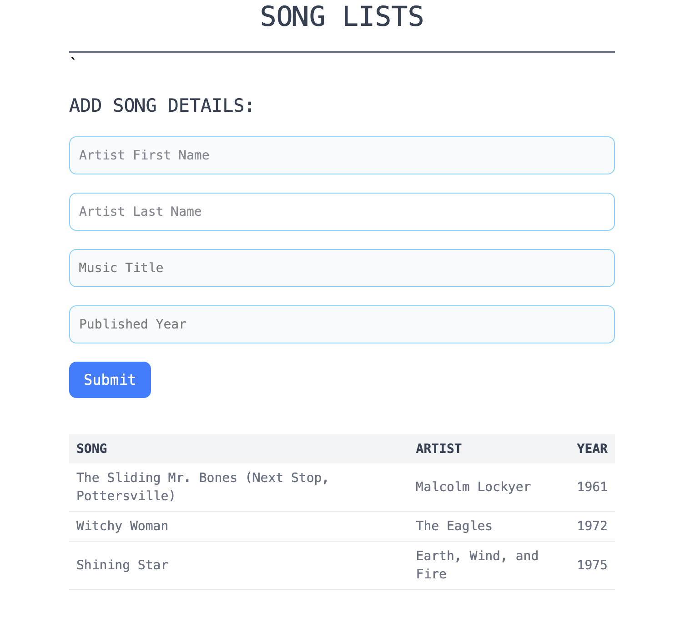

# 🎵 Song List App

A simple, responsive web interface for listing and adding songs using HTML and Tailwind CSS. This project demonstrates basic form handling, table data display, and UI structuring with utility-first CSS.

---

## 📌 Features

- Input form to add song details (artist name, title, year)
- Responsive layout using Tailwind CSS
- Styled data table for song display
- Clean and accessible UI design
- Minimal dependencies (no JavaScript yet — coming soon!)

---

## 📚 Case Study: Why Tailwind CSS?

Tailwind CSS was chosen for this project to:

- 💡 **Speed up development**: Utility-first classes make it easy to style directly in HTML.
- 🎨 **Maintain consistency**: Avoids scattered or repetitive custom CSS.
- ⚡ **Keep it lightweight**: No extra stylesheets, just Tailwind's CDN build.
- 📱 **Responsive by default**: Layout adapts easily across screen sizes.

Example: Inputs and table rows were styled using Tailwind’s utility classes for borders, spacing, and colors — no need for custom CSS.

---

## 🏗️ Tech Stack

- HTML5
- [Tailwind CSS](https://tailwindcss.com/) (via CDN)
- 💻 Coming soon: JavaScript for dynamic table updates

---

## 🖼️ Screenshot



---

## 🚀 Getting Started

Clone this repository and open the HTML file in your browser.

```bash
git clone https://github.com/saiful1121212/songlists.git
cd songlists
open index.html
